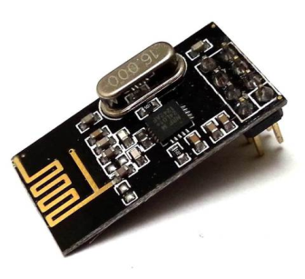

# nRF24-PSoC-5LP-Library

This library provides full functionality of the nrf24l01 transceiver module.

## Project

The library was part of a project to build a wireless sensor network. The microcontroller chosen for the application was the Cypress PSoC 5LP, a Cortex-M3 programmable system on chip device. To run this library on different MCUs the header file sould be modified to matched the hadware/software interface provided for the host MCU.

  

## Software

* PSoc Creator.

## License

This project is licensed under the MIT License - see the [LICENSE.md](LICENSE.md) file for details
